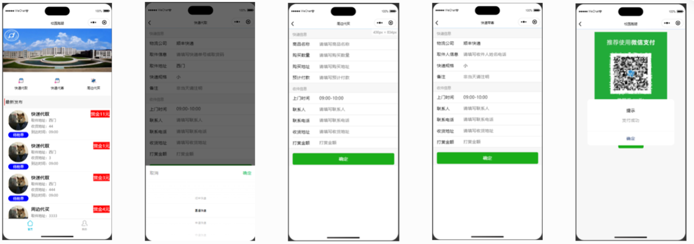
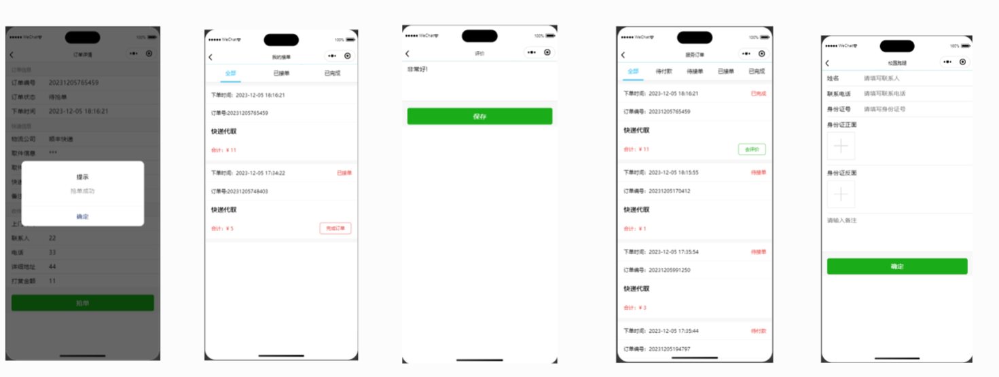
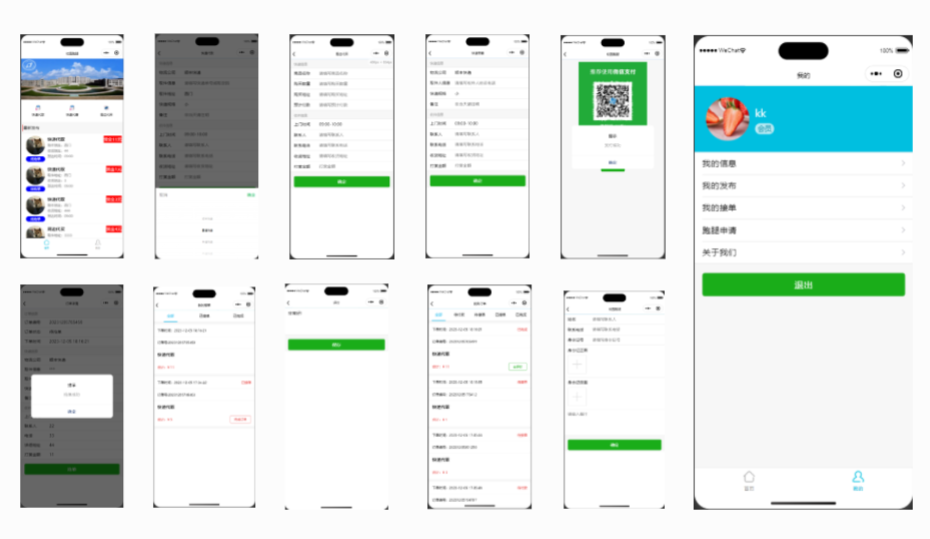
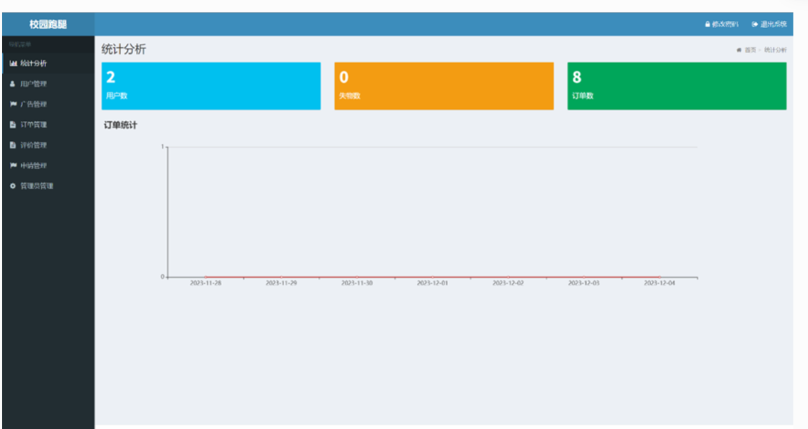
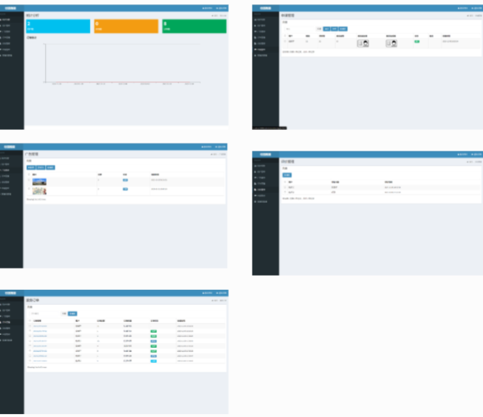

** 校园跑腿/校园快递代领微信小程序 有配套论文 **

**联系方式:** MasterwareDev  注意:请备注哪里加我的!!!  可定制其他微信小程序项目!!!

** 贴图链接:** https://boardmix.cn/app/share/CAE.CJPdgAwgASoQ7vLiUnV6dU8mK__Mu3yFTjAGQAE/dlu1jd，
点击链接加入boardmix中的文件「快递跑腿」

**开发环境及工具：**

大等于jdk1.8，大于mysql5.5，idea（eclipse），微信开发者工具

**技术说明：**

springboot mybatis html vue.js bootstrap 小程序

代码注释齐全，没有多余代码，适合学习(毕设)，二次开发，包含论文技术相关文档。

**功能介绍：**

**用户端：**

登录注册（含授权登录）

首页显示轮播图，快递代寄代取，周边代买，失物招领，最新发布的需求

点击快递代寄代取，周边代买，进入到发布界面，可以发布相关需求

点击需求列表进入详情，骑手小哥有抢单权限

用户还可以发布失物招领信息

个人中心显示我的信息（可编辑），我的发布，我的服务（骑手小哥权限），跑腿申请

**后台管理：**

统计分析：查看用户，失物，订单数量；统计近7日订单趋势

用户管理：查看注册用户信息，及删除，可以修改用户角色（普通用户，骑手小哥）

订单管理：显示发布订单信息，可删除

失物管理：显示发布信息，可删除

申请管理：审核跑腿小哥

管理员管理：后台管理员增删改查

